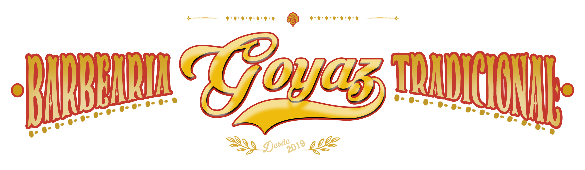

<h1 align="center">
    
     
    Goyaz Barber 2.0
</h1>

<h4 align="center">
    App mobile of the Goyaz Barber barbershop.
</h4>

  
  
  

  <a href="#crystal_ball-technologies">Technologies</a>&nbsp;&nbsp;&nbsp;|&nbsp;&nbsp;&nbsp;
  <a href="#iphone-features">Features</a>&nbsp;&nbsp;&nbsp;|&nbsp;&nbsp;&nbsp;
  <a href="#information_source-how-to-run">How to run</a>&nbsp;&nbsp;&nbsp;|&nbsp;&nbsp;&nbsp;
  <a href="#computer-backend">Backend</a>&nbsp;&nbsp;&nbsp;|&nbsp;&nbsp;&nbsp;
  <a href="#warning-disclaimer">Disclaimer</a>

## :crystal_ball: Technologies

This project was developed with the following technologies:

- [react-native](https://reactnative.dev/)
- [react](https://pt-br.reactjs.org/)
- [styled-components](https://styled-components.com/)
- [react-native-chart-kit](https://github.com/indiespirit/react-native-chart-kit)
- [react-native-vector-icons](https://github.com/oblador/react-native-vector-icons)
- [unform](https://github.com/Rocketseat/unform)
- [date-fns](https://date-fns.org/)
- [async-storage](https://github.com/react-native-community/async-storage)
- [react-navigation](https://reactnavigation.org/)

## :iphone: Features

Test

## :information_source: How to run

Coming soon

## :computer: Backend

See also the <a href="https://github.com/matheusf31/goyaz-barber-backend-2">backend!</a> of this app!

## :warning: Disclaimer

Why does this app have '2' in its name?

Because I have another version of this project, written with Javascript, and I haven't finished it yet and I decided to rewrite the entire project using Typescript.

---

Made with ♥ by Matheus Filipe :wave: [Get in touch!](https://www.linkedin.com/in/matheus-filipe-351106186/) And here is a <a href="https://goyazbarber.tecteu.com">Easter egg</a> :)
